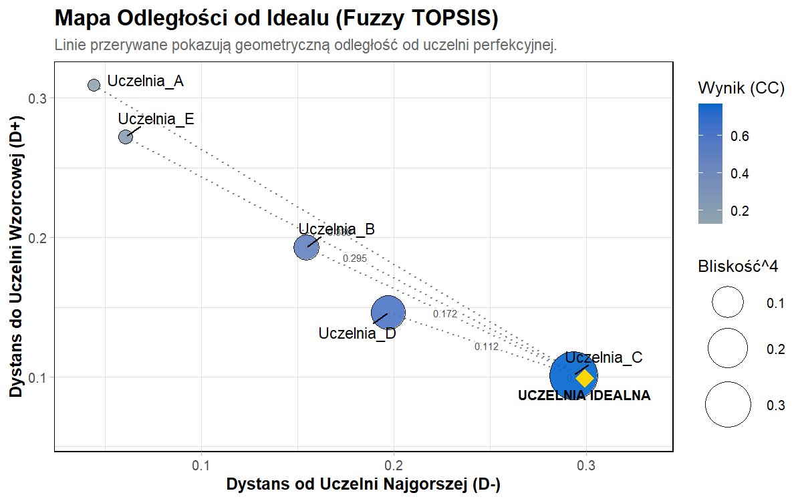
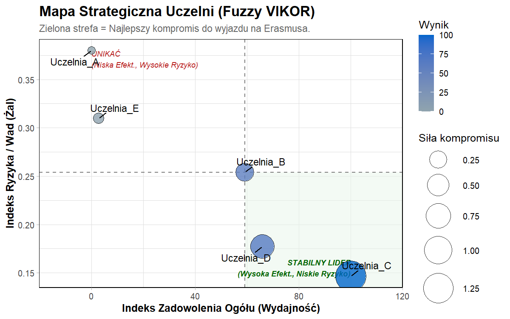
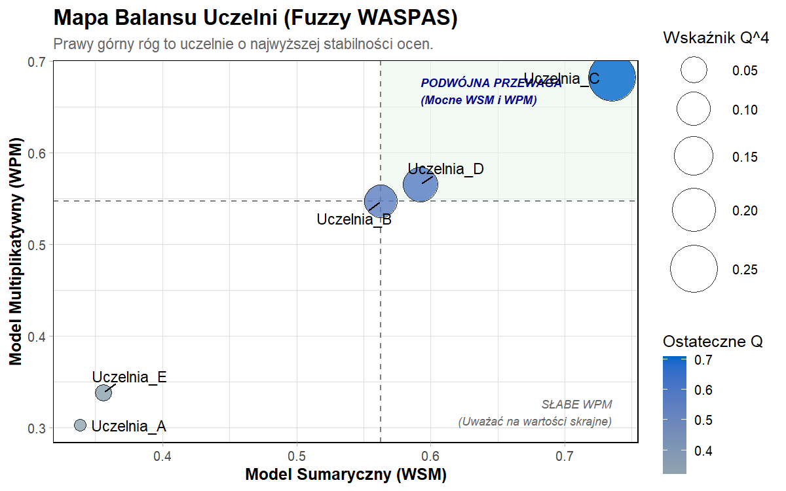

# ErasmusMobilityR

**ErasmusMobilityR** to kompleksowe narzędzie analityczne przeznaczone
do Wielokryterialnej Analizy Decyzyjnej (MCDA) w środowisku rozmytym.
Pakiet został zaprojektowany z myślą o ewaluacji i rankingu uczelni
partnerskich w ramach programu Erasmus+.

Umożliwia pełną ścieżkę badawczą: od agregacji surowych ankiet
studenckich, przez wyznaczanie wag metodą **BWM (Best-Worst Method)**,
aż po zaawansowane rankingi metodami **Fuzzy TOPSIS, Fuzzy VIKOR i Fuzzy
WASPAS**, zwieńczone autorskim **Meta-Rankingiem**.

## Instalacja

Najwygodniej zainstalować wersję deweloperską razem z zależnościami
potrzebnymi do poradnika i renderowania tabel:

``` r
install.packages("remotes")

remotes::install_github(
  "nikolaw11/ErasmusMobilityR",
  dependencies = TRUE,
  build_vignettes = TRUE
)
```

Po instalacji pełny poradnik można otworzyć poleceniem:

``` r
browseVignettes("ErasmusMobilityR")
vignette("poradnik_mcda", package = "ErasmusMobilityR")
```

## Szybki start

Poniższy przykład jest renderowany automatycznie z `README.Rmd`, dlatego
tabele i wykresy w README na GitHubie są aktualizowane razem z kodem
pakietu.

``` r
library(ErasmusMobilityR)

data("mcda_dane_surowe")

skladnia_modelu_erasmus <- "
  Finanse      =~ wysokosc_stypendium + koszty_zycia_mies;
  Jakosc       =~ ranking_uczelni + kompatybilnosc_prog + ocena_biura_erasmus + jakosc_wykladowcow + dostepnosc_akademik;
  Zadowolenie  =~ satysfakcja_program + spolecznosc_int;
  Miasto       =~ odleglosc_od_macierzystej + bezpieczenstwo_miasta + atrakcyjnosc_miasta
"

rozmyta_macierz <- zbuduj_macierz_rozmyta(
  dane = mcda_dane_surowe,
  skladnia = skladnia_modelu_erasmus,
  kolumna_uczelni = "Uczelnia"
)

kryteria_erasmus <- c("Finanse", "Jakosc", "Zadowolenie", "Miasto")
kierunki_erasmus <- rep("max", length(kryteria_erasmus))
ankieta_best_to_others <- c(1, 2, 3, 8)
ankieta_others_to_worst <- c(8, 4, 2, 1)

wyniki_topsis <- wyznacz_ranking_topsis(
  rozmyta_macierz_decyzyjna = rozmyta_macierz,
  kierunki_kryteriow = kierunki_erasmus,
  nazwy_kryteriow_bwm = kryteria_erasmus,
  bwm_najlepsze = ankieta_best_to_others,
  bwm_najgorsze = ankieta_others_to_worst
)

wyniki_vikor <- wyznacz_ranking_vikor(
  rozmyta_macierz_decyzyjna = rozmyta_macierz,
  kierunki_kryteriow = kierunki_erasmus,
  nazwy_kryteriow_bwm = kryteria_erasmus,
  bwm_najlepsze = ankieta_best_to_others,
  bwm_najgorsze = ankieta_others_to_worst
)

wyniki_waspas <- wyznacz_ranking_waspas(
  rozmyta_macierz_decyzyjna = rozmyta_macierz,
  kierunki_kryteriow = kierunki_erasmus,
  nazwy_kryteriow_bwm = kryteria_erasmus,
  bwm_najlepsze = ankieta_best_to_others,
  bwm_najgorsze = ankieta_others_to_worst
)

meta_wynik <- wyznacz_meta_ranking_erasmus(
  rozmyta_macierz_decyzyjna = rozmyta_macierz,
  kierunki_kryteriow = kierunki_erasmus,
  nazwy_kryteriow_bwm = kryteria_erasmus,
  bwm_najlepsze = ankieta_best_to_others,
  bwm_najgorsze = ankieta_others_to_worst
)

print(meta_wynik$porownanie)
#>   Uczelnia_Partnerska Miejsce_TOPSIS Miejsce_VIKOR Miejsce_WASPAS
#> 1          Uczelnia_C              1             1              1
#> 2          Uczelnia_D              2             2              2
#> 3          Uczelnia_B              3             3              3
#> 4          Uczelnia_E              4             4              4
#> 5          Uczelnia_A              5             5              5
#>   Meta_Srednia_Pozycja Meta_Dominacja Meta_Konsensus_RA
#> 1                    1              1                 1
#> 2                    2              2                 2
#> 3                    3              3                 3
#> 4                    4              4                 4
#> 5                    5              5                 5
```

## Tabele APA

Tabele poniżej są tworzone funkcją `tabela_apa()` i osadzane w README
jako HTML.

<style></style>

<div class="tabwid">

<style>.apa-topsis-01{table-layout:auto;}.apa-topsis-02{font-family:'Times New Roman';font-size:12pt;font-weight:bold;font-style:normal;text-decoration:none;color:rgba(0, 0, 0, 1.00);background-color:transparent;}.apa-topsis-03{font-family:'Times New Roman';font-size:12pt;font-weight:normal;font-style:italic;text-decoration:none;color:rgba(0, 0, 0, 1.00);background-color:transparent;}.apa-topsis-04{font-family:'Times New Roman';font-size:12pt;font-weight:normal;font-style:normal;text-decoration:none;color:rgba(0, 0, 0, 1.00);background-color:transparent;}.apa-topsis-05{margin:0;text-align:left;border-bottom: 0 solid rgba(0, 0, 0, 1.00);border-top: 0 solid rgba(0, 0, 0, 1.00);border-left: 0 solid rgba(0, 0, 0, 1.00);border-right: 0 solid rgba(0, 0, 0, 1.00);padding-bottom:5pt;padding-top:5pt;padding-left:5pt;padding-right:5pt;line-height: 2;background-color:transparent;}.apa-topsis-06{margin:0;text-align:center;border-bottom: 0 solid rgba(0, 0, 0, 1.00);border-top: 0 solid rgba(0, 0, 0, 1.00);border-left: 0 solid rgba(0, 0, 0, 1.00);border-right: 0 solid rgba(0, 0, 0, 1.00);padding-bottom:5pt;padding-top:5pt;padding-left:5pt;padding-right:5pt;line-height: 2;background-color:transparent;}.apa-topsis-07{margin:0;text-align:left;border-bottom: 0 solid rgba(0, 0, 0, 1.00);border-top: 0 solid rgba(0, 0, 0, 1.00);border-left: 0 solid rgba(0, 0, 0, 1.00);border-right: 0 solid rgba(0, 0, 0, 1.00);padding-bottom:5pt;padding-top:5pt;padding-left:5pt;padding-right:5pt;line-height: 1;background-color:transparent;}.apa-topsis-08{background-color:transparent;vertical-align: middle;border-bottom: 0 solid rgba(102, 102, 102, 1.00);border-top: 0 solid rgba(102, 102, 102, 1.00);border-left: 0 solid rgba(0, 0, 0, 1.00);border-right: 0 solid rgba(0, 0, 0, 1.00);margin-bottom:0;margin-top:0;margin-left:0;margin-right:0;}.apa-topsis-09{background-color:transparent;vertical-align: middle;border-bottom: 0.5pt solid rgba(0, 0, 0, 1.00);border-top: 0 solid rgba(102, 102, 102, 1.00);border-left: 0 solid rgba(0, 0, 0, 1.00);border-right: 0 solid rgba(0, 0, 0, 1.00);margin-bottom:0;margin-top:0;margin-left:0;margin-right:0;}.apa-topsis-10{background-color:transparent;vertical-align: middle;border-bottom: 0.5pt solid rgba(0, 0, 0, 1.00);border-top: 0.5pt solid rgba(0, 0, 0, 1.00);border-left: 0 solid rgba(0, 0, 0, 1.00);border-right: 0 solid rgba(0, 0, 0, 1.00);margin-bottom:0;margin-top:0;margin-left:0;margin-right:0;}.apa-topsis-11{background-color:transparent;vertical-align: middle;border-bottom: 0 solid rgba(0, 0, 0, 1.00);border-top: 0 solid rgba(0, 0, 0, 1.00);border-left: 0 solid rgba(0, 0, 0, 1.00);border-right: 0 solid rgba(0, 0, 0, 1.00);margin-bottom:0;margin-top:0;margin-left:0;margin-right:0;}.apa-topsis-12{background-color:transparent;vertical-align: middle;border-bottom: 0 solid rgba(0, 0, 0, 1.00);border-top: 0 solid rgba(0, 0, 0, 1.00);border-left: 0 solid rgba(0, 0, 0, 1.00);border-right: 0 solid rgba(0, 0, 0, 1.00);margin-bottom:0;margin-top:0;margin-left:0;margin-right:0;}.apa-topsis-13{background-color:transparent;vertical-align: middle;border-bottom: 0.5pt solid rgba(0, 0, 0, 1.00);border-top: 0 solid rgba(0, 0, 0, 1.00);border-left: 0 solid rgba(0, 0, 0, 1.00);border-right: 0 solid rgba(0, 0, 0, 1.00);margin-bottom:0;margin-top:0;margin-left:0;margin-right:0;}.apa-topsis-14{background-color:transparent;vertical-align: middle;border-bottom: 0.5pt solid rgba(0, 0, 0, 1.00);border-top: 0 solid rgba(0, 0, 0, 1.00);border-left: 0 solid rgba(0, 0, 0, 1.00);border-right: 0 solid rgba(0, 0, 0, 1.00);margin-bottom:0;margin-top:0;margin-left:0;margin-right:0;}.apa-topsis-15{background-color:transparent;vertical-align: middle;border-bottom: 0 solid rgba(255, 255, 255, 0.00);border-top: 0 solid rgba(255, 255, 255, 0.00);border-left: 0 solid rgba(255, 255, 255, 0.00);border-right: 0 solid rgba(255, 255, 255, 0.00);margin-bottom:0;margin-top:0;margin-left:0;margin-right:0;}</style>

<table data-quarto-disable-processing="true" class="apa-topsis-01">

<thead>

<tr style="overflow-wrap:break-word;">

<th colspan="5" class="apa-topsis-08">

<p class="apa-topsis-05">

<span class="apa-topsis-02">Tabela 1</span>
</p>

</th>

</tr>

<tr style="overflow-wrap:break-word;">

<th colspan="5" class="apa-topsis-09">

<p class="apa-topsis-05">

<span class="apa-topsis-03">Wyniki metody Fuzzy TOPSIS</span>
</p>

</th>

</tr>

<tr style="overflow-wrap:break-word;">

<th class="apa-topsis-10">

<p class="apa-topsis-06">

<span class="apa-topsis-04">Uczelnia Partnerska</span>
</p>

</th>

<th class="apa-topsis-10">

<p class="apa-topsis-06">

<span class="apa-topsis-04">D+ (Odległość od Ideału)</span>
</p>

</th>

<th class="apa-topsis-10">

<p class="apa-topsis-06">

<span class="apa-topsis-04">D- (Odległość od Antyideału)</span>
</p>

</th>

<th class="apa-topsis-10">

<p class="apa-topsis-06">

<span class="apa-topsis-04">Współczynnik (CC)</span>
</p>

</th>

<th class="apa-topsis-10">

<p class="apa-topsis-06">

<span class="apa-topsis-04">Pozycja w Rankingu</span>
</p>

</th>

</tr>

</thead>

<tbody>

<tr style="overflow-wrap:break-word;">

<td class="apa-topsis-11">

<p class="apa-topsis-05">

<span class="apa-topsis-04">Uczelnia_C</span>
</p>

</td>

<td class="apa-topsis-12">

<p class="apa-topsis-06">

<span class="apa-topsis-04">0.10</span>
</p>

</td>

<td class="apa-topsis-12">

<p class="apa-topsis-06">

<span class="apa-topsis-04">0.29</span>
</p>

</td>

<td class="apa-topsis-12">

<p class="apa-topsis-06">

<span class="apa-topsis-04">0.77</span>
</p>

</td>

<td class="apa-topsis-12">

<p class="apa-topsis-06">

<span class="apa-topsis-04">1</span>
</p>

</td>

</tr>

<tr style="overflow-wrap:break-word;">

<td class="apa-topsis-11">

<p class="apa-topsis-05">

<span class="apa-topsis-04">Uczelnia_D</span>
</p>

</td>

<td class="apa-topsis-12">

<p class="apa-topsis-06">

<span class="apa-topsis-04">0.15</span>
</p>

</td>

<td class="apa-topsis-12">

<p class="apa-topsis-06">

<span class="apa-topsis-04">0.20</span>
</p>

</td>

<td class="apa-topsis-12">

<p class="apa-topsis-06">

<span class="apa-topsis-04">0.60</span>
</p>

</td>

<td class="apa-topsis-12">

<p class="apa-topsis-06">

<span class="apa-topsis-04">2</span>
</p>

</td>

</tr>

<tr style="overflow-wrap:break-word;">

<td class="apa-topsis-11">

<p class="apa-topsis-05">

<span class="apa-topsis-04">Uczelnia_B</span>
</p>

</td>

<td class="apa-topsis-12">

<p class="apa-topsis-06">

<span class="apa-topsis-04">0.19</span>
</p>

</td>

<td class="apa-topsis-12">

<p class="apa-topsis-06">

<span class="apa-topsis-04">0.15</span>
</p>

</td>

<td class="apa-topsis-12">

<p class="apa-topsis-06">

<span class="apa-topsis-04">0.47</span>
</p>

</td>

<td class="apa-topsis-12">

<p class="apa-topsis-06">

<span class="apa-topsis-04">3</span>
</p>

</td>

</tr>

<tr style="overflow-wrap:break-word;">

<td class="apa-topsis-11">

<p class="apa-topsis-05">

<span class="apa-topsis-04">Uczelnia_E</span>
</p>

</td>

<td class="apa-topsis-12">

<p class="apa-topsis-06">

<span class="apa-topsis-04">0.27</span>
</p>

</td>

<td class="apa-topsis-12">

<p class="apa-topsis-06">

<span class="apa-topsis-04">0.06</span>
</p>

</td>

<td class="apa-topsis-12">

<p class="apa-topsis-06">

<span class="apa-topsis-04">0.19</span>
</p>

</td>

<td class="apa-topsis-12">

<p class="apa-topsis-06">

<span class="apa-topsis-04">4</span>
</p>

</td>

</tr>

<tr style="overflow-wrap:break-word;">

<td class="apa-topsis-13">

<p class="apa-topsis-05">

<span class="apa-topsis-04">Uczelnia_A</span>
</p>

</td>

<td class="apa-topsis-14">

<p class="apa-topsis-06">

<span class="apa-topsis-04">0.31</span>
</p>

</td>

<td class="apa-topsis-14">

<p class="apa-topsis-06">

<span class="apa-topsis-04">0.04</span>
</p>

</td>

<td class="apa-topsis-14">

<p class="apa-topsis-06">

<span class="apa-topsis-04">0.13</span>
</p>

</td>

<td class="apa-topsis-14">

<p class="apa-topsis-06">

<span class="apa-topsis-04">5</span>
</p>

</td>

</tr>

</tbody>

<tfoot>

<tr style="overflow-wrap:break-word;">

<td colspan="5" class="apa-topsis-15">

<p class="apa-topsis-07">

<span class="apa-topsis-03">Note.
</span><span class="apa-topsis-04">Uwaga. CC - Coefficient of Closeness
(Współczynnik Bliskości). Im wyższa wartość, tym lepsza alternatywa do
wyjazdu na Erasmusa.</span>
</p>

</td>

</tr>

</tfoot>

</table>

</div>

<style></style>

<div class="tabwid">

<style>.apa-vikor-01{table-layout:auto;}.apa-vikor-02{font-family:'Times New Roman';font-size:12pt;font-weight:bold;font-style:normal;text-decoration:none;color:rgba(0, 0, 0, 1.00);background-color:transparent;}.apa-vikor-03{font-family:'Times New Roman';font-size:12pt;font-weight:normal;font-style:italic;text-decoration:none;color:rgba(0, 0, 0, 1.00);background-color:transparent;}.apa-vikor-04{font-family:'Times New Roman';font-size:12pt;font-weight:normal;font-style:normal;text-decoration:none;color:rgba(0, 0, 0, 1.00);background-color:transparent;}.apa-vikor-05{margin:0;text-align:left;border-bottom: 0 solid rgba(0, 0, 0, 1.00);border-top: 0 solid rgba(0, 0, 0, 1.00);border-left: 0 solid rgba(0, 0, 0, 1.00);border-right: 0 solid rgba(0, 0, 0, 1.00);padding-bottom:5pt;padding-top:5pt;padding-left:5pt;padding-right:5pt;line-height: 2;background-color:transparent;}.apa-vikor-06{margin:0;text-align:center;border-bottom: 0 solid rgba(0, 0, 0, 1.00);border-top: 0 solid rgba(0, 0, 0, 1.00);border-left: 0 solid rgba(0, 0, 0, 1.00);border-right: 0 solid rgba(0, 0, 0, 1.00);padding-bottom:5pt;padding-top:5pt;padding-left:5pt;padding-right:5pt;line-height: 2;background-color:transparent;}.apa-vikor-07{margin:0;text-align:left;border-bottom: 0 solid rgba(0, 0, 0, 1.00);border-top: 0 solid rgba(0, 0, 0, 1.00);border-left: 0 solid rgba(0, 0, 0, 1.00);border-right: 0 solid rgba(0, 0, 0, 1.00);padding-bottom:5pt;padding-top:5pt;padding-left:5pt;padding-right:5pt;line-height: 1;background-color:transparent;}.apa-vikor-08{background-color:transparent;vertical-align: middle;border-bottom: 0 solid rgba(102, 102, 102, 1.00);border-top: 0 solid rgba(102, 102, 102, 1.00);border-left: 0 solid rgba(0, 0, 0, 1.00);border-right: 0 solid rgba(0, 0, 0, 1.00);margin-bottom:0;margin-top:0;margin-left:0;margin-right:0;}.apa-vikor-09{background-color:transparent;vertical-align: middle;border-bottom: 0.5pt solid rgba(0, 0, 0, 1.00);border-top: 0 solid rgba(102, 102, 102, 1.00);border-left: 0 solid rgba(0, 0, 0, 1.00);border-right: 0 solid rgba(0, 0, 0, 1.00);margin-bottom:0;margin-top:0;margin-left:0;margin-right:0;}.apa-vikor-10{background-color:transparent;vertical-align: middle;border-bottom: 0.5pt solid rgba(0, 0, 0, 1.00);border-top: 0.5pt solid rgba(0, 0, 0, 1.00);border-left: 0 solid rgba(0, 0, 0, 1.00);border-right: 0 solid rgba(0, 0, 0, 1.00);margin-bottom:0;margin-top:0;margin-left:0;margin-right:0;}.apa-vikor-11{background-color:transparent;vertical-align: middle;border-bottom: 0 solid rgba(0, 0, 0, 1.00);border-top: 0 solid rgba(0, 0, 0, 1.00);border-left: 0 solid rgba(0, 0, 0, 1.00);border-right: 0 solid rgba(0, 0, 0, 1.00);margin-bottom:0;margin-top:0;margin-left:0;margin-right:0;}.apa-vikor-12{background-color:transparent;vertical-align: middle;border-bottom: 0 solid rgba(0, 0, 0, 1.00);border-top: 0 solid rgba(0, 0, 0, 1.00);border-left: 0 solid rgba(0, 0, 0, 1.00);border-right: 0 solid rgba(0, 0, 0, 1.00);margin-bottom:0;margin-top:0;margin-left:0;margin-right:0;}.apa-vikor-13{background-color:transparent;vertical-align: middle;border-bottom: 0.5pt solid rgba(0, 0, 0, 1.00);border-top: 0 solid rgba(0, 0, 0, 1.00);border-left: 0 solid rgba(0, 0, 0, 1.00);border-right: 0 solid rgba(0, 0, 0, 1.00);margin-bottom:0;margin-top:0;margin-left:0;margin-right:0;}.apa-vikor-14{background-color:transparent;vertical-align: middle;border-bottom: 0.5pt solid rgba(0, 0, 0, 1.00);border-top: 0 solid rgba(0, 0, 0, 1.00);border-left: 0 solid rgba(0, 0, 0, 1.00);border-right: 0 solid rgba(0, 0, 0, 1.00);margin-bottom:0;margin-top:0;margin-left:0;margin-right:0;}.apa-vikor-15{background-color:transparent;vertical-align: middle;border-bottom: 0 solid rgba(255, 255, 255, 0.00);border-top: 0 solid rgba(255, 255, 255, 0.00);border-left: 0 solid rgba(255, 255, 255, 0.00);border-right: 0 solid rgba(255, 255, 255, 0.00);margin-bottom:0;margin-top:0;margin-left:0;margin-right:0;}</style>

<table data-quarto-disable-processing="true" class="apa-vikor-01">

<thead>

<tr style="overflow-wrap:break-word;">

<th colspan="5" class="apa-vikor-08">

<p class="apa-vikor-05">

<span class="apa-vikor-02">Tabela 2</span>
</p>

</th>

</tr>

<tr style="overflow-wrap:break-word;">

<th colspan="5" class="apa-vikor-09">

<p class="apa-vikor-05">

<span class="apa-vikor-03">Wyniki metody Fuzzy VIKOR</span>
</p>

</th>

</tr>

<tr style="overflow-wrap:break-word;">

<th class="apa-vikor-10">

<p class="apa-vikor-06">

<span class="apa-vikor-04">Uczelnia Partnerska</span>
</p>

</th>

<th class="apa-vikor-10">

<p class="apa-vikor-06">

<span class="apa-vikor-04">Wskaźnik S (Użyteczność)</span>
</p>

</th>

<th class="apa-vikor-10">

<p class="apa-vikor-06">

<span class="apa-vikor-04">Wskaźnik R (Żal)</span>
</p>

</th>

<th class="apa-vikor-10">

<p class="apa-vikor-06">

<span class="apa-vikor-04">Indeks Q (Kompromis)</span>
</p>

</th>

<th class="apa-vikor-10">

<p class="apa-vikor-06">

<span class="apa-vikor-04">Pozycja w Rankingu</span>
</p>

</th>

</tr>

</thead>

<tbody>

<tr style="overflow-wrap:break-word;">

<td class="apa-vikor-11">

<p class="apa-vikor-05">

<span class="apa-vikor-04">Uczelnia_C</span>
</p>

</td>

<td class="apa-vikor-12">

<p class="apa-vikor-06">

<span class="apa-vikor-04">0.16</span>
</p>

</td>

<td class="apa-vikor-12">

<p class="apa-vikor-06">

<span class="apa-vikor-04">0.15</span>
</p>

</td>

<td class="apa-vikor-12">

<p class="apa-vikor-06">

<span class="apa-vikor-04">0.28</span>
</p>

</td>

<td class="apa-vikor-12">

<p class="apa-vikor-06">

<span class="apa-vikor-04">1</span>
</p>

</td>

</tr>

<tr style="overflow-wrap:break-word;">

<td class="apa-vikor-11">

<p class="apa-vikor-05">

<span class="apa-vikor-04">Uczelnia_D</span>
</p>

</td>

<td class="apa-vikor-12">

<p class="apa-vikor-06">

<span class="apa-vikor-04">0.32</span>
</p>

</td>

<td class="apa-vikor-12">

<p class="apa-vikor-06">

<span class="apa-vikor-04">0.18</span>
</p>

</td>

<td class="apa-vikor-12">

<p class="apa-vikor-06">

<span class="apa-vikor-04">0.38</span>
</p>

</td>

<td class="apa-vikor-12">

<p class="apa-vikor-06">

<span class="apa-vikor-04">2</span>
</p>

</td>

</tr>

<tr style="overflow-wrap:break-word;">

<td class="apa-vikor-11">

<p class="apa-vikor-05">

<span class="apa-vikor-04">Uczelnia_B</span>
</p>

</td>

<td class="apa-vikor-12">

<p class="apa-vikor-06">

<span class="apa-vikor-04">0.35</span>
</p>

</td>

<td class="apa-vikor-12">

<p class="apa-vikor-06">

<span class="apa-vikor-04">0.25</span>
</p>

</td>

<td class="apa-vikor-12">

<p class="apa-vikor-06">

<span class="apa-vikor-04">0.48</span>
</p>

</td>

<td class="apa-vikor-12">

<p class="apa-vikor-06">

<span class="apa-vikor-04">3</span>
</p>

</td>

</tr>

<tr style="overflow-wrap:break-word;">

<td class="apa-vikor-11">

<p class="apa-vikor-05">

<span class="apa-vikor-04">Uczelnia_E</span>
</p>

</td>

<td class="apa-vikor-12">

<p class="apa-vikor-06">

<span class="apa-vikor-04">0.61</span>
</p>

</td>

<td class="apa-vikor-12">

<p class="apa-vikor-06">

<span class="apa-vikor-04">0.31</span>
</p>

</td>

<td class="apa-vikor-12">

<p class="apa-vikor-06">

<span class="apa-vikor-04">0.66</span>
</p>

</td>

<td class="apa-vikor-12">

<p class="apa-vikor-06">

<span class="apa-vikor-04">4</span>
</p>

</td>

</tr>

<tr style="overflow-wrap:break-word;">

<td class="apa-vikor-13">

<p class="apa-vikor-05">

<span class="apa-vikor-04">Uczelnia_A</span>
</p>

</td>

<td class="apa-vikor-14">

<p class="apa-vikor-06">

<span class="apa-vikor-04">0.62</span>
</p>

</td>

<td class="apa-vikor-14">

<p class="apa-vikor-06">

<span class="apa-vikor-04">0.38</span>
</p>

</td>

<td class="apa-vikor-14">

<p class="apa-vikor-06">

<span class="apa-vikor-04">0.74</span>
</p>

</td>

<td class="apa-vikor-14">

<p class="apa-vikor-06">

<span class="apa-vikor-04">5</span>
</p>

</td>

</tr>

</tbody>

<tfoot>

<tr style="overflow-wrap:break-word;">

<td colspan="5" class="apa-vikor-15">

<p class="apa-vikor-07">

<span class="apa-vikor-03">Note.
</span><span class="apa-vikor-04">Uwaga. S: maksymalizacja użyteczności
grupowej, R: minimalizacja indywidualnego żalu, Q: ostateczny indeks
kompromisu (im mniej, tym lepiej).</span>
</p>

</td>

</tr>

</tfoot>

</table>

</div>

<style></style>

<div class="tabwid">

<style>.apa-waspas-01{table-layout:auto;}.apa-waspas-02{font-family:'Times New Roman';font-size:12pt;font-weight:bold;font-style:normal;text-decoration:none;color:rgba(0, 0, 0, 1.00);background-color:transparent;}.apa-waspas-03{font-family:'Times New Roman';font-size:12pt;font-weight:normal;font-style:italic;text-decoration:none;color:rgba(0, 0, 0, 1.00);background-color:transparent;}.apa-waspas-04{font-family:'Times New Roman';font-size:12pt;font-weight:normal;font-style:normal;text-decoration:none;color:rgba(0, 0, 0, 1.00);background-color:transparent;}.apa-waspas-05{margin:0;text-align:left;border-bottom: 0 solid rgba(0, 0, 0, 1.00);border-top: 0 solid rgba(0, 0, 0, 1.00);border-left: 0 solid rgba(0, 0, 0, 1.00);border-right: 0 solid rgba(0, 0, 0, 1.00);padding-bottom:5pt;padding-top:5pt;padding-left:5pt;padding-right:5pt;line-height: 2;background-color:transparent;}.apa-waspas-06{margin:0;text-align:center;border-bottom: 0 solid rgba(0, 0, 0, 1.00);border-top: 0 solid rgba(0, 0, 0, 1.00);border-left: 0 solid rgba(0, 0, 0, 1.00);border-right: 0 solid rgba(0, 0, 0, 1.00);padding-bottom:5pt;padding-top:5pt;padding-left:5pt;padding-right:5pt;line-height: 2;background-color:transparent;}.apa-waspas-07{margin:0;text-align:left;border-bottom: 0 solid rgba(0, 0, 0, 1.00);border-top: 0 solid rgba(0, 0, 0, 1.00);border-left: 0 solid rgba(0, 0, 0, 1.00);border-right: 0 solid rgba(0, 0, 0, 1.00);padding-bottom:5pt;padding-top:5pt;padding-left:5pt;padding-right:5pt;line-height: 1;background-color:transparent;}.apa-waspas-08{background-color:transparent;vertical-align: middle;border-bottom: 0 solid rgba(102, 102, 102, 1.00);border-top: 0 solid rgba(102, 102, 102, 1.00);border-left: 0 solid rgba(0, 0, 0, 1.00);border-right: 0 solid rgba(0, 0, 0, 1.00);margin-bottom:0;margin-top:0;margin-left:0;margin-right:0;}.apa-waspas-09{background-color:transparent;vertical-align: middle;border-bottom: 0.5pt solid rgba(0, 0, 0, 1.00);border-top: 0 solid rgba(102, 102, 102, 1.00);border-left: 0 solid rgba(0, 0, 0, 1.00);border-right: 0 solid rgba(0, 0, 0, 1.00);margin-bottom:0;margin-top:0;margin-left:0;margin-right:0;}.apa-waspas-10{background-color:transparent;vertical-align: middle;border-bottom: 0.5pt solid rgba(0, 0, 0, 1.00);border-top: 0.5pt solid rgba(0, 0, 0, 1.00);border-left: 0 solid rgba(0, 0, 0, 1.00);border-right: 0 solid rgba(0, 0, 0, 1.00);margin-bottom:0;margin-top:0;margin-left:0;margin-right:0;}.apa-waspas-11{background-color:transparent;vertical-align: middle;border-bottom: 0 solid rgba(0, 0, 0, 1.00);border-top: 0 solid rgba(0, 0, 0, 1.00);border-left: 0 solid rgba(0, 0, 0, 1.00);border-right: 0 solid rgba(0, 0, 0, 1.00);margin-bottom:0;margin-top:0;margin-left:0;margin-right:0;}.apa-waspas-12{background-color:transparent;vertical-align: middle;border-bottom: 0 solid rgba(0, 0, 0, 1.00);border-top: 0 solid rgba(0, 0, 0, 1.00);border-left: 0 solid rgba(0, 0, 0, 1.00);border-right: 0 solid rgba(0, 0, 0, 1.00);margin-bottom:0;margin-top:0;margin-left:0;margin-right:0;}.apa-waspas-13{background-color:transparent;vertical-align: middle;border-bottom: 0.5pt solid rgba(0, 0, 0, 1.00);border-top: 0 solid rgba(0, 0, 0, 1.00);border-left: 0 solid rgba(0, 0, 0, 1.00);border-right: 0 solid rgba(0, 0, 0, 1.00);margin-bottom:0;margin-top:0;margin-left:0;margin-right:0;}.apa-waspas-14{background-color:transparent;vertical-align: middle;border-bottom: 0.5pt solid rgba(0, 0, 0, 1.00);border-top: 0 solid rgba(0, 0, 0, 1.00);border-left: 0 solid rgba(0, 0, 0, 1.00);border-right: 0 solid rgba(0, 0, 0, 1.00);margin-bottom:0;margin-top:0;margin-left:0;margin-right:0;}.apa-waspas-15{background-color:transparent;vertical-align: middle;border-bottom: 0 solid rgba(255, 255, 255, 0.00);border-top: 0 solid rgba(255, 255, 255, 0.00);border-left: 0 solid rgba(255, 255, 255, 0.00);border-right: 0 solid rgba(255, 255, 255, 0.00);margin-bottom:0;margin-top:0;margin-left:0;margin-right:0;}</style>

<table data-quarto-disable-processing="true" class="apa-waspas-01">

<thead>

<tr style="overflow-wrap:break-word;">

<th colspan="5" class="apa-waspas-08">

<p class="apa-waspas-05">

<span class="apa-waspas-02">Tabela 3</span>
</p>

</th>

</tr>

<tr style="overflow-wrap:break-word;">

<th colspan="5" class="apa-waspas-09">

<p class="apa-waspas-05">

<span class="apa-waspas-03">Wyniki metody Fuzzy WASPAS</span>
</p>

</th>

</tr>

<tr style="overflow-wrap:break-word;">

<th class="apa-waspas-10">

<p class="apa-waspas-06">

<span class="apa-waspas-04">Uczelnia Partnerska</span>
</p>

</th>

<th class="apa-waspas-10">

<p class="apa-waspas-06">

<span class="apa-waspas-04">WSM (Model Sumaryczny)</span>
</p>

</th>

<th class="apa-waspas-10">

<p class="apa-waspas-06">

<span class="apa-waspas-04">WPM (Model Iloczynowy)</span>
</p>

</th>

<th class="apa-waspas-10">

<p class="apa-waspas-06">

<span class="apa-waspas-04">Wskaźnik Q (WASPAS)</span>
</p>

</th>

<th class="apa-waspas-10">

<p class="apa-waspas-06">

<span class="apa-waspas-04">Pozycja w Rankingu</span>
</p>

</th>

</tr>

</thead>

<tbody>

<tr style="overflow-wrap:break-word;">

<td class="apa-waspas-11">

<p class="apa-waspas-05">

<span class="apa-waspas-04">Uczelnia_C</span>
</p>

</td>

<td class="apa-waspas-12">

<p class="apa-waspas-06">

<span class="apa-waspas-04">0.73</span>
</p>

</td>

<td class="apa-waspas-12">

<p class="apa-waspas-06">

<span class="apa-waspas-04">0.68</span>
</p>

</td>

<td class="apa-waspas-12">

<p class="apa-waspas-06">

<span class="apa-waspas-04">0.71</span>
</p>

</td>

<td class="apa-waspas-12">

<p class="apa-waspas-06">

<span class="apa-waspas-04">1</span>
</p>

</td>

</tr>

<tr style="overflow-wrap:break-word;">

<td class="apa-waspas-11">

<p class="apa-waspas-05">

<span class="apa-waspas-04">Uczelnia_D</span>
</p>

</td>

<td class="apa-waspas-12">

<p class="apa-waspas-06">

<span class="apa-waspas-04">0.59</span>
</p>

</td>

<td class="apa-waspas-12">

<p class="apa-waspas-06">

<span class="apa-waspas-04">0.56</span>
</p>

</td>

<td class="apa-waspas-12">

<p class="apa-waspas-06">

<span class="apa-waspas-04">0.58</span>
</p>

</td>

<td class="apa-waspas-12">

<p class="apa-waspas-06">

<span class="apa-waspas-04">2</span>
</p>

</td>

</tr>

<tr style="overflow-wrap:break-word;">

<td class="apa-waspas-11">

<p class="apa-waspas-05">

<span class="apa-waspas-04">Uczelnia_B</span>
</p>

</td>

<td class="apa-waspas-12">

<p class="apa-waspas-06">

<span class="apa-waspas-04">0.56</span>
</p>

</td>

<td class="apa-waspas-12">

<p class="apa-waspas-06">

<span class="apa-waspas-04">0.55</span>
</p>

</td>

<td class="apa-waspas-12">

<p class="apa-waspas-06">

<span class="apa-waspas-04">0.55</span>
</p>

</td>

<td class="apa-waspas-12">

<p class="apa-waspas-06">

<span class="apa-waspas-04">3</span>
</p>

</td>

</tr>

<tr style="overflow-wrap:break-word;">

<td class="apa-waspas-11">

<p class="apa-waspas-05">

<span class="apa-waspas-04">Uczelnia_E</span>
</p>

</td>

<td class="apa-waspas-12">

<p class="apa-waspas-06">

<span class="apa-waspas-04">0.36</span>
</p>

</td>

<td class="apa-waspas-12">

<p class="apa-waspas-06">

<span class="apa-waspas-04">0.34</span>
</p>

</td>

<td class="apa-waspas-12">

<p class="apa-waspas-06">

<span class="apa-waspas-04">0.35</span>
</p>

</td>

<td class="apa-waspas-12">

<p class="apa-waspas-06">

<span class="apa-waspas-04">4</span>
</p>

</td>

</tr>

<tr style="overflow-wrap:break-word;">

<td class="apa-waspas-13">

<p class="apa-waspas-05">

<span class="apa-waspas-04">Uczelnia_A</span>
</p>

</td>

<td class="apa-waspas-14">

<p class="apa-waspas-06">

<span class="apa-waspas-04">0.34</span>
</p>

</td>

<td class="apa-waspas-14">

<p class="apa-waspas-06">

<span class="apa-waspas-04">0.30</span>
</p>

</td>

<td class="apa-waspas-14">

<p class="apa-waspas-06">

<span class="apa-waspas-04">0.32</span>
</p>

</td>

<td class="apa-waspas-14">

<p class="apa-waspas-06">

<span class="apa-waspas-04">5</span>
</p>

</td>

</tr>

</tbody>

<tfoot>

<tr style="overflow-wrap:break-word;">

<td colspan="5" class="apa-waspas-15">

<p class="apa-waspas-07">

<span class="apa-waspas-03">Note.
</span><span class="apa-waspas-04">Uwaga. Model WASPAS łączy podejście
sumowane (WSM) oraz multiplikatywne (WPM) w jeden wskaźnik
użyteczności.</span>
</p>

</td>

</tr>

</tfoot>

</table>

</div>

<style></style>

<div class="tabwid">

<style>.apa-meta-01{table-layout:auto;}.apa-meta-02{font-family:'Times New Roman';font-size:12pt;font-weight:bold;font-style:normal;text-decoration:none;color:rgba(0, 0, 0, 1.00);background-color:transparent;}.apa-meta-03{font-family:'Times New Roman';font-size:12pt;font-weight:normal;font-style:italic;text-decoration:none;color:rgba(0, 0, 0, 1.00);background-color:transparent;}.apa-meta-04{font-family:'Times New Roman';font-size:12pt;font-weight:normal;font-style:normal;text-decoration:none;color:rgba(0, 0, 0, 1.00);background-color:transparent;}.apa-meta-05{margin:0;text-align:left;border-bottom: 0 solid rgba(0, 0, 0, 1.00);border-top: 0 solid rgba(0, 0, 0, 1.00);border-left: 0 solid rgba(0, 0, 0, 1.00);border-right: 0 solid rgba(0, 0, 0, 1.00);padding-bottom:5pt;padding-top:5pt;padding-left:5pt;padding-right:5pt;line-height: 2;background-color:transparent;}.apa-meta-06{margin:0;text-align:center;border-bottom: 0 solid rgba(0, 0, 0, 1.00);border-top: 0 solid rgba(0, 0, 0, 1.00);border-left: 0 solid rgba(0, 0, 0, 1.00);border-right: 0 solid rgba(0, 0, 0, 1.00);padding-bottom:5pt;padding-top:5pt;padding-left:5pt;padding-right:5pt;line-height: 2;background-color:transparent;}.apa-meta-07{margin:0;text-align:left;border-bottom: 0 solid rgba(0, 0, 0, 1.00);border-top: 0 solid rgba(0, 0, 0, 1.00);border-left: 0 solid rgba(0, 0, 0, 1.00);border-right: 0 solid rgba(0, 0, 0, 1.00);padding-bottom:5pt;padding-top:5pt;padding-left:5pt;padding-right:5pt;line-height: 1;background-color:transparent;}.apa-meta-08{background-color:transparent;vertical-align: middle;border-bottom: 0 solid rgba(102, 102, 102, 1.00);border-top: 0 solid rgba(102, 102, 102, 1.00);border-left: 0 solid rgba(0, 0, 0, 1.00);border-right: 0 solid rgba(0, 0, 0, 1.00);margin-bottom:0;margin-top:0;margin-left:0;margin-right:0;}.apa-meta-09{background-color:transparent;vertical-align: middle;border-bottom: 0.5pt solid rgba(0, 0, 0, 1.00);border-top: 0 solid rgba(102, 102, 102, 1.00);border-left: 0 solid rgba(0, 0, 0, 1.00);border-right: 0 solid rgba(0, 0, 0, 1.00);margin-bottom:0;margin-top:0;margin-left:0;margin-right:0;}.apa-meta-10{background-color:transparent;vertical-align: middle;border-bottom: 0.5pt solid rgba(0, 0, 0, 1.00);border-top: 0.5pt solid rgba(0, 0, 0, 1.00);border-left: 0 solid rgba(0, 0, 0, 1.00);border-right: 0 solid rgba(0, 0, 0, 1.00);margin-bottom:0;margin-top:0;margin-left:0;margin-right:0;}.apa-meta-11{background-color:transparent;vertical-align: middle;border-bottom: 0 solid rgba(0, 0, 0, 1.00);border-top: 0 solid rgba(0, 0, 0, 1.00);border-left: 0 solid rgba(0, 0, 0, 1.00);border-right: 0 solid rgba(0, 0, 0, 1.00);margin-bottom:0;margin-top:0;margin-left:0;margin-right:0;}.apa-meta-12{background-color:transparent;vertical-align: middle;border-bottom: 0 solid rgba(0, 0, 0, 1.00);border-top: 0 solid rgba(0, 0, 0, 1.00);border-left: 0 solid rgba(0, 0, 0, 1.00);border-right: 0 solid rgba(0, 0, 0, 1.00);margin-bottom:0;margin-top:0;margin-left:0;margin-right:0;}.apa-meta-13{background-color:transparent;vertical-align: middle;border-bottom: 0.5pt solid rgba(0, 0, 0, 1.00);border-top: 0 solid rgba(0, 0, 0, 1.00);border-left: 0 solid rgba(0, 0, 0, 1.00);border-right: 0 solid rgba(0, 0, 0, 1.00);margin-bottom:0;margin-top:0;margin-left:0;margin-right:0;}.apa-meta-14{background-color:transparent;vertical-align: middle;border-bottom: 0.5pt solid rgba(0, 0, 0, 1.00);border-top: 0 solid rgba(0, 0, 0, 1.00);border-left: 0 solid rgba(0, 0, 0, 1.00);border-right: 0 solid rgba(0, 0, 0, 1.00);margin-bottom:0;margin-top:0;margin-left:0;margin-right:0;}.apa-meta-15{background-color:transparent;vertical-align: middle;border-bottom: 0 solid rgba(255, 255, 255, 0.00);border-top: 0 solid rgba(255, 255, 255, 0.00);border-left: 0 solid rgba(255, 255, 255, 0.00);border-right: 0 solid rgba(255, 255, 255, 0.00);margin-bottom:0;margin-top:0;margin-left:0;margin-right:0;}</style>

<table data-quarto-disable-processing="true" class="apa-meta-01">

<thead>

<tr style="overflow-wrap:break-word;">

<th colspan="7" class="apa-meta-08">

<p class="apa-meta-05">

<span class="apa-meta-02">Tabela 4</span>
</p>

</th>

</tr>

<tr style="overflow-wrap:break-word;">

<th colspan="7" class="apa-meta-09">

<p class="apa-meta-05">

<span class="apa-meta-03">Ostateczny Meta-Ranking Uczelni
(Konsensus)</span>
</p>

</th>

</tr>

<tr style="overflow-wrap:break-word;">

<th class="apa-meta-10">

<p class="apa-meta-06">

<span class="apa-meta-04">Uczelnia Partnerska</span>
</p>

</th>

<th class="apa-meta-10">

<p class="apa-meta-06">

<span class="apa-meta-04">Miejsce TOPSIS</span>
</p>

</th>

<th class="apa-meta-10">

<p class="apa-meta-06">

<span class="apa-meta-04">Miejsce VIKOR</span>
</p>

</th>

<th class="apa-meta-10">

<p class="apa-meta-06">

<span class="apa-meta-04">Miejsce WASPAS</span>
</p>

</th>

<th class="apa-meta-10">

<p class="apa-meta-06">

<span class="apa-meta-04">Suma Pozycji (Borda)</span>
</p>

</th>

<th class="apa-meta-10">

<p class="apa-meta-06">

<span class="apa-meta-04">Reguła Dominacji</span>
</p>

</th>

<th class="apa-meta-10">

<p class="apa-meta-06">

<span class="apa-meta-04">Algorytm Genetyczny (RA)</span>
</p>

</th>

</tr>

</thead>

<tbody>

<tr style="overflow-wrap:break-word;">

<td class="apa-meta-11">

<p class="apa-meta-05">

<span class="apa-meta-04">Uczelnia_C</span>
</p>

</td>

<td class="apa-meta-12">

<p class="apa-meta-06">

<span class="apa-meta-04">1</span>
</p>

</td>

<td class="apa-meta-12">

<p class="apa-meta-06">

<span class="apa-meta-04">1</span>
</p>

</td>

<td class="apa-meta-12">

<p class="apa-meta-06">

<span class="apa-meta-04">1</span>
</p>

</td>

<td class="apa-meta-12">

<p class="apa-meta-06">

<span class="apa-meta-04">1</span>
</p>

</td>

<td class="apa-meta-12">

<p class="apa-meta-06">

<span class="apa-meta-04">1.00</span>
</p>

</td>

<td class="apa-meta-12">

<p class="apa-meta-06">

<span class="apa-meta-04">1.00</span>
</p>

</td>

</tr>

<tr style="overflow-wrap:break-word;">

<td class="apa-meta-11">

<p class="apa-meta-05">

<span class="apa-meta-04">Uczelnia_D</span>
</p>

</td>

<td class="apa-meta-12">

<p class="apa-meta-06">

<span class="apa-meta-04">2</span>
</p>

</td>

<td class="apa-meta-12">

<p class="apa-meta-06">

<span class="apa-meta-04">2</span>
</p>

</td>

<td class="apa-meta-12">

<p class="apa-meta-06">

<span class="apa-meta-04">2</span>
</p>

</td>

<td class="apa-meta-12">

<p class="apa-meta-06">

<span class="apa-meta-04">2</span>
</p>

</td>

<td class="apa-meta-12">

<p class="apa-meta-06">

<span class="apa-meta-04">2.00</span>
</p>

</td>

<td class="apa-meta-12">

<p class="apa-meta-06">

<span class="apa-meta-04">2.00</span>
</p>

</td>

</tr>

<tr style="overflow-wrap:break-word;">

<td class="apa-meta-11">

<p class="apa-meta-05">

<span class="apa-meta-04">Uczelnia_B</span>
</p>

</td>

<td class="apa-meta-12">

<p class="apa-meta-06">

<span class="apa-meta-04">3</span>
</p>

</td>

<td class="apa-meta-12">

<p class="apa-meta-06">

<span class="apa-meta-04">3</span>
</p>

</td>

<td class="apa-meta-12">

<p class="apa-meta-06">

<span class="apa-meta-04">3</span>
</p>

</td>

<td class="apa-meta-12">

<p class="apa-meta-06">

<span class="apa-meta-04">3</span>
</p>

</td>

<td class="apa-meta-12">

<p class="apa-meta-06">

<span class="apa-meta-04">3.00</span>
</p>

</td>

<td class="apa-meta-12">

<p class="apa-meta-06">

<span class="apa-meta-04">3.00</span>
</p>

</td>

</tr>

<tr style="overflow-wrap:break-word;">

<td class="apa-meta-11">

<p class="apa-meta-05">

<span class="apa-meta-04">Uczelnia_E</span>
</p>

</td>

<td class="apa-meta-12">

<p class="apa-meta-06">

<span class="apa-meta-04">4</span>
</p>

</td>

<td class="apa-meta-12">

<p class="apa-meta-06">

<span class="apa-meta-04">4</span>
</p>

</td>

<td class="apa-meta-12">

<p class="apa-meta-06">

<span class="apa-meta-04">4</span>
</p>

</td>

<td class="apa-meta-12">

<p class="apa-meta-06">

<span class="apa-meta-04">4</span>
</p>

</td>

<td class="apa-meta-12">

<p class="apa-meta-06">

<span class="apa-meta-04">4.00</span>
</p>

</td>

<td class="apa-meta-12">

<p class="apa-meta-06">

<span class="apa-meta-04">4.00</span>
</p>

</td>

</tr>

<tr style="overflow-wrap:break-word;">

<td class="apa-meta-13">

<p class="apa-meta-05">

<span class="apa-meta-04">Uczelnia_A</span>
</p>

</td>

<td class="apa-meta-14">

<p class="apa-meta-06">

<span class="apa-meta-04">5</span>
</p>

</td>

<td class="apa-meta-14">

<p class="apa-meta-06">

<span class="apa-meta-04">5</span>
</p>

</td>

<td class="apa-meta-14">

<p class="apa-meta-06">

<span class="apa-meta-04">5</span>
</p>

</td>

<td class="apa-meta-14">

<p class="apa-meta-06">

<span class="apa-meta-04">5</span>
</p>

</td>

<td class="apa-meta-14">

<p class="apa-meta-06">

<span class="apa-meta-04">5.00</span>
</p>

</td>

<td class="apa-meta-14">

<p class="apa-meta-06">

<span class="apa-meta-04">5.00</span>
</p>

</td>

</tr>

</tbody>

<tfoot>

<tr style="overflow-wrap:break-word;">

<td colspan="7" class="apa-meta-15">

<p class="apa-meta-07">

<span class="apa-meta-03">Note. </span><span class="apa-meta-04">Uwaga.
Zestawienie rang uzyskanych z trzech niezależnych algorytmów (TOPSIS,
VIKOR, WASPAS) oraz ostateczne wyznaczenie lidera za pomocą algorytmu
konsensusu.</span>
</p>

</td>

</tr>

</tfoot>

</table>

</div>

## Wizualizacja

Wykresy są generowane podczas renderowania README, więc pliki PNG w
`man/figures/` nie wymagają ręcznego odświeżania.







## Synchronizacja dokumentacji

Lokalnie README i vignette można odtworzyć jednym poleceniem:

``` bash
Rscript tools/render-docs.R
```

Ten sam krok działa w GitHub Actions. Workflow renderuje `README.Rmd`,
buduje vignette oraz sprawdza, czy `README.md` i pliki
`man/figures/README-*.png` są zsynchronizowane.
